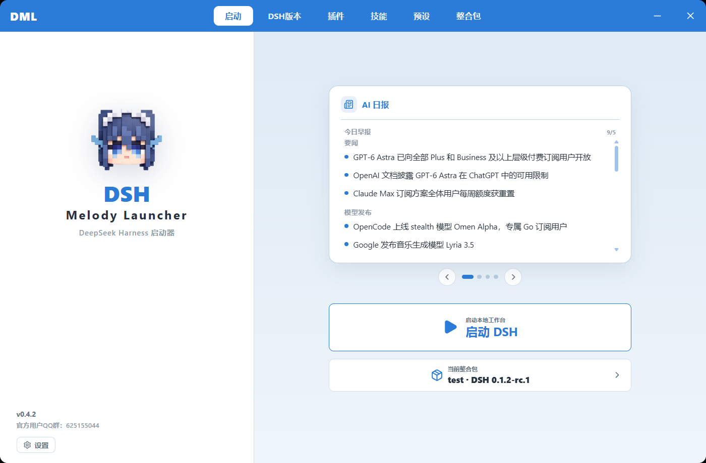
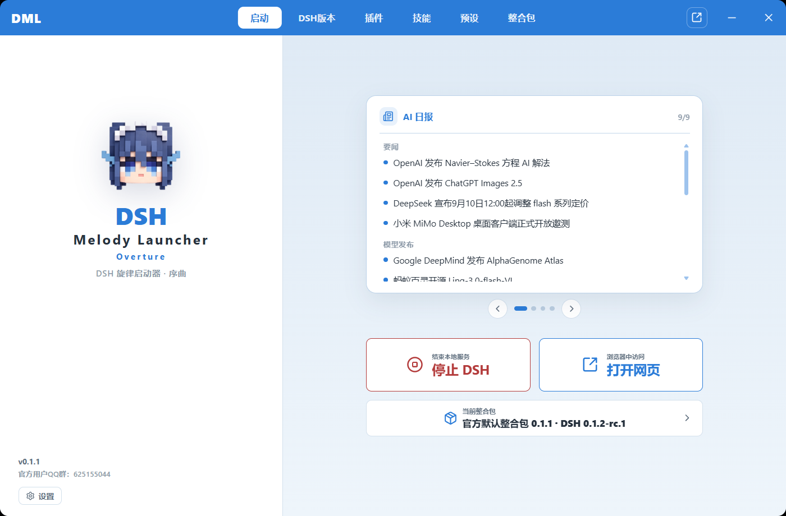
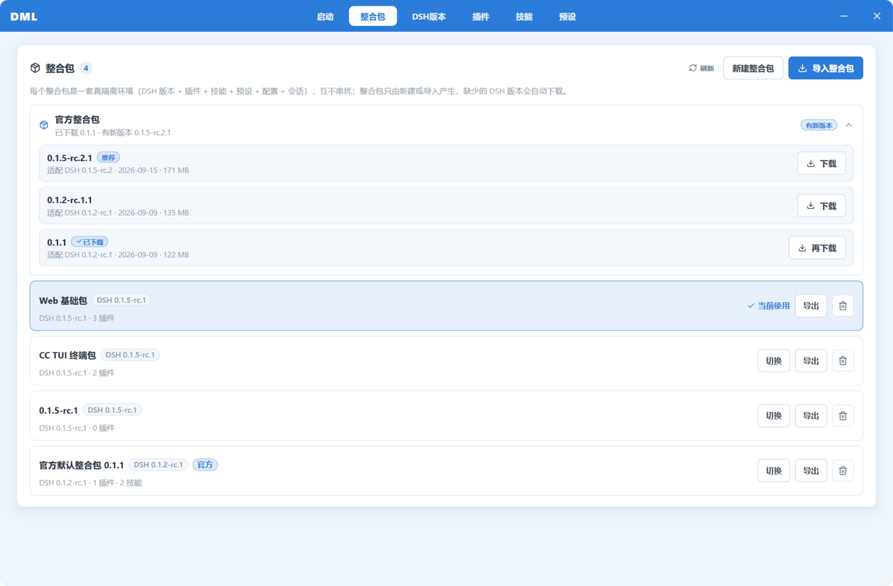
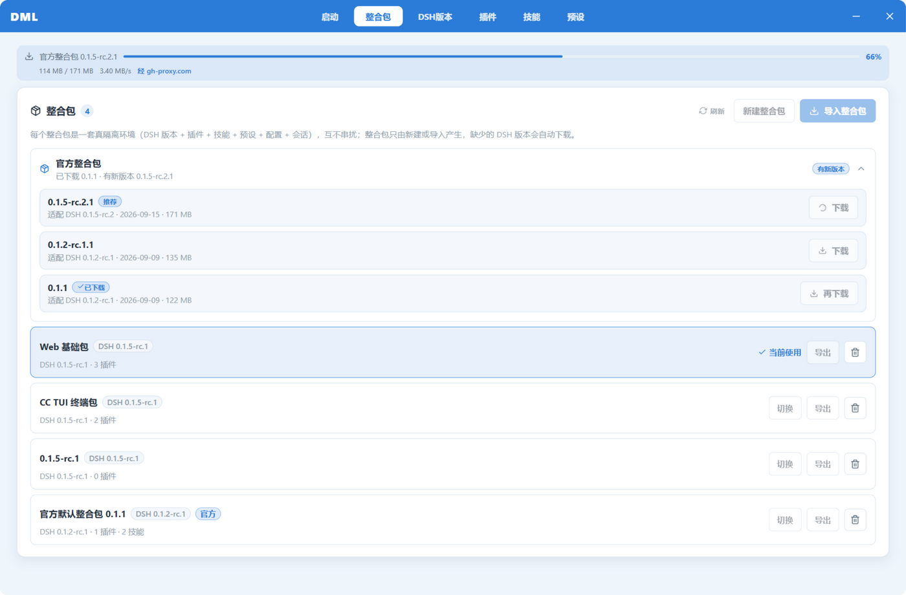
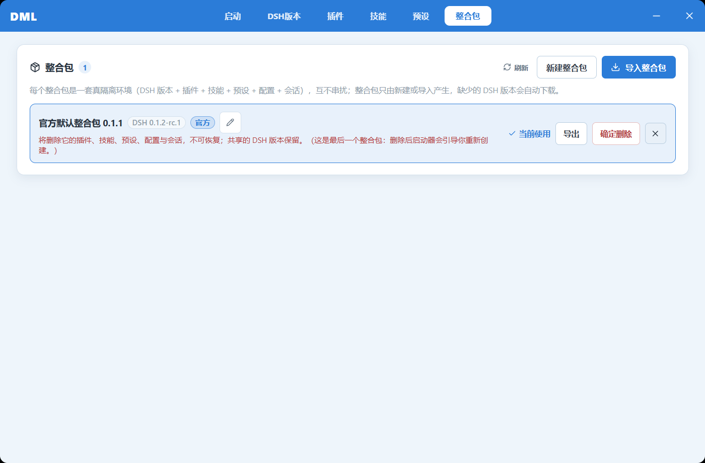
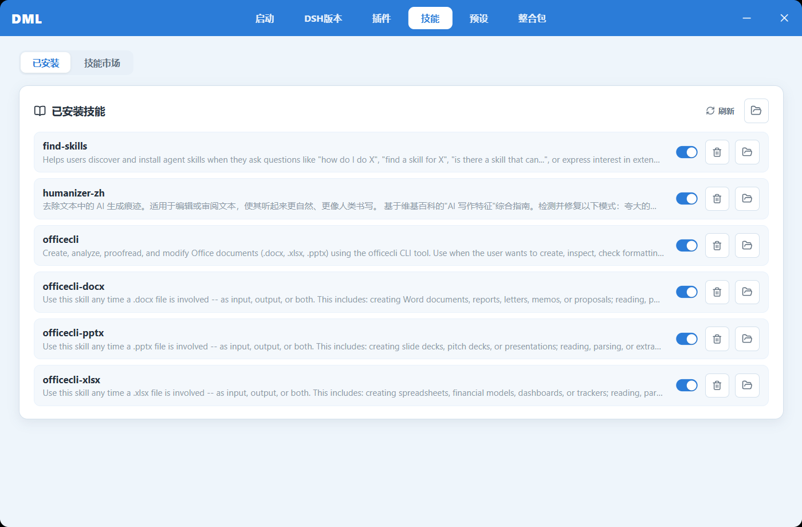
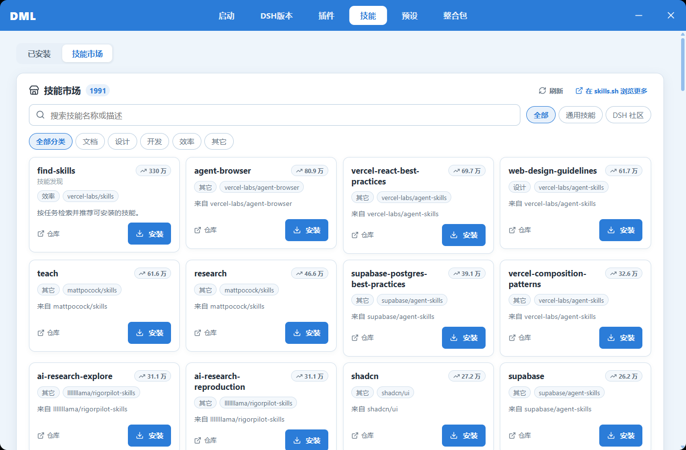
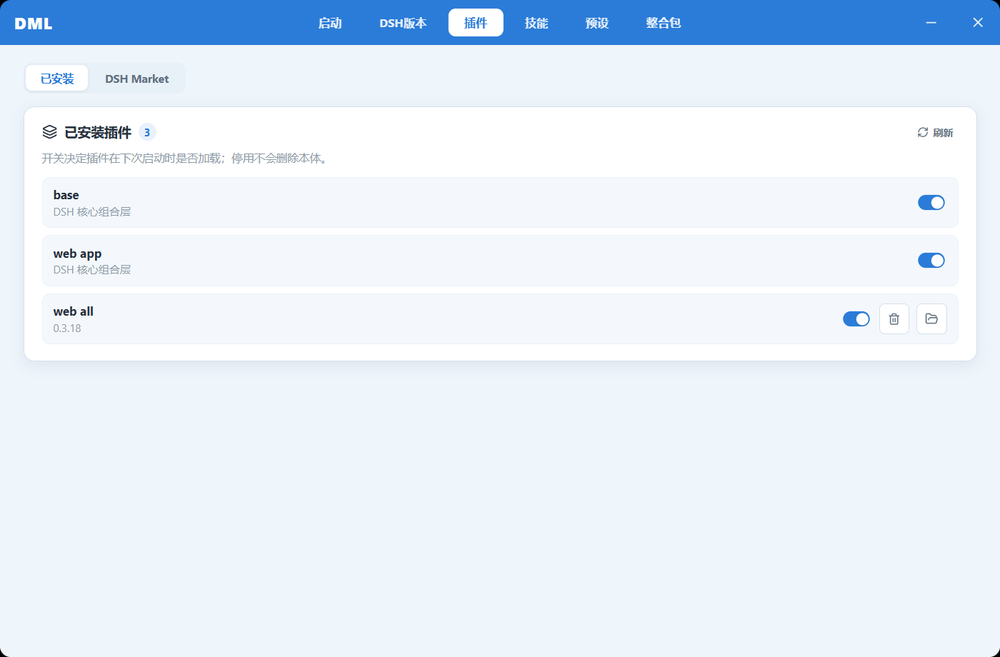
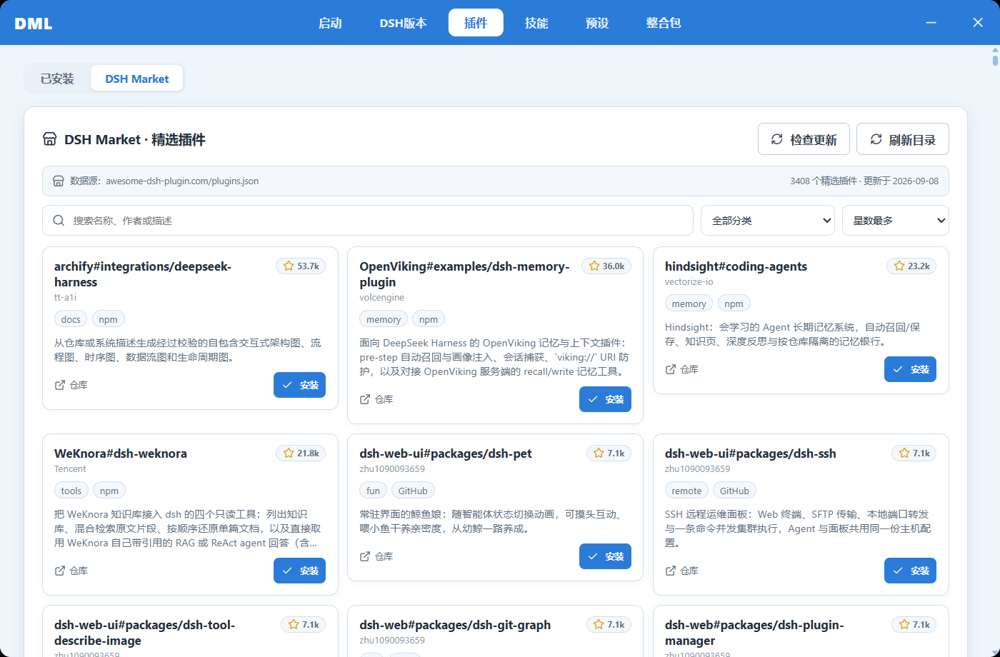
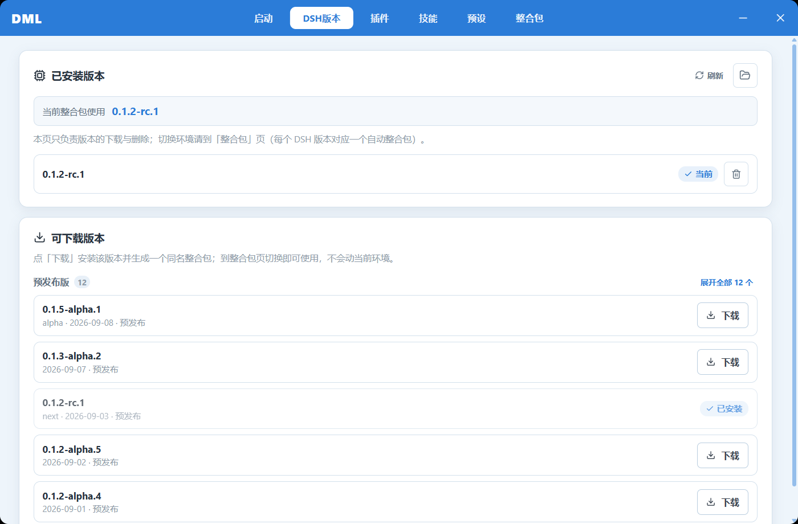

<div align="center">


# DSH Melody Launcher: Overture

**A Windows desktop launcher for [DeepSeek Harness](https://github.com/deepseek-ai/deepseek-harness) — the C-end branch of [rirko/dsh-melody-launcher](https://github.com/rirko/dsh-melody-launcher)**

Download one executable: the first run auto-imports the **official default modpack** — DSH itself, a full web UI, and Office document skills. Hit Launch and you can chat, build slide decks and write reports. Nothing to preinstall.

[](https://github.com/Miyazawai/DSH-Melody-Launcher-Overture/releases/latest)
[](https://github.com/Miyazawai/DSH-Melody-Launcher-Overture/actions/workflows/build.yml)
[](https://github.com/Miyazawai/DSH-Melody-Launcher-Overture/releases)
[](https://github.com/rirko/dsh-melody-launcher)
[](https://github.com/Miyazawai/DSH-Melody-Launcher-Overture)

**[简体中文](README.md) · English**

</div>

---

> [!NOTE]
> **Overture** is the C-end ("modpack-first") line of [rirko/dsh-melody-launcher](https://github.com/rirko/dsh-melody-launcher). The upstream repo hosts the mainline; this branch focuses on the first-km experience for individual players: zero-dependency onboarding, per-pack isolation, whole-pack sharing. See the [Chinese README](README.md) for the full documentation.

## What's new in v0.1.3

- **Pick the official modpack version you want** — the Modpacks page now has an "official modpack" stack listing every published version (latest marked *Recommended*, each row showing the **DSH version it targets** and its size). Re-downloading a version gives you a `(2)` copy; a new release only raises a badge — nothing heavy is downloaded behind your back.
- **The whole download is visible, and a slow link switches itself** — a progress bar with live speed and source ("50% · 3.4 MB/s · via gh-proxy.com"), followed by the import stages (installing the missing DSH runtime, unpacking ~16k files), so it no longer looks stuck at 100%. Direct connections that stall for 8s, break for 20s, or drop under 300 KB/s **fail over to a mirror automatically** — no proxy fiddling required.
- **Easier network setup** — the GitHub mirror setting is now a dropdown (Auto / gh-proxy.com / ghfast.top / ghproxy.net / Custom); "Auto" is the failover described above.

## What's new in v0.1.2

- **Plugin auto-update works again** — the update panel used to show "Local development mode" forever and refuse to update: the launcher wrote a non-official manifest name for the modpack Profile, which plugins read as a local dev link. Names now follow DSH's own convention, and **existing modpacks are migrated automatically on startup — no reinstall needed**.

## What's new in v0.1.1

- **Official default modpack** — auto-fetched and imported on first run: DSH + full web UI + Office document skills (Word / Excel / PowerPoint) + a Chinese anti-AI-slop writing skill. Deletable, and restorable anytime with one click.
- **Snapshot export / import** — a modpack zips up whole (plugin bodies, dependencies, skills, config included). Personal data (API keys, sessions, usage) is stripped and absolute paths rewritten before shipping. Your friend imports the zip and it just runs — no network reinstall.
- **Office skills powered by [OfficeCLI](https://github.com/iOfficeAI/OfficeCLI)** — the engine binary travels inside the pack, so "turn this quarter's data into a deck" produces an editable `.pptx` out of the box.
- **Split launch button** — while the service runs, the home button splits: stop on the left, reopen the web page on the right.
- **Atomic pack deletion** — deleting a pack whose files are still held by a running DSH now fails as a whole instead of half-wiping the environment.

## Screenshots

| Home | Running (split button) |
| --- | --- |
|  |  |
| **Modpacks** (official stack with every version) | **Download progress** (speed, source, stage — auto failover) |
|  |  |
| **Delete confirmation** (arm-then-confirm, never a dialog) | **Skills** (Office suite included, uninstall built in) |
|  |  |
| **Skill Market** (1,900+ skills) | **Plugins** (core bundles protected) |
|  |  |
| **DSH Market** (3,400+ featured plugins) | **DSH versions** (installed vs. available) |
|  |  |

## Highlights

- **Modpacks = real isolation** — each pack gets a derived home directory; DSH version, plugins, skills, presets and sessions never leak across packs.
- **Zero-dependency onboarding** — the launcher downloads DSH, a portable Node.js runtime (SHA-256 verified, resumable) and a private pnpm automatically. GitHub traffic goes through a mirror-first candidate chain, and the 100 MB+ official modpack additionally **fails over by measured speed**: a stalled first byte, a 20s silence or an average below 300 KB/s switches to the next source.
- **Curated markets** — DSH Market (3,400+ featured plugins) and a Skill Market (1,900+ skills), with strict `SKILL.md` validation and enable/disable that never deletes files.
- **One-click launch** — starts `dsh --profile <pack> --no-open --port N`, opens the browser when ready; crashes surface as a dialog with exit code, stderr and a copyable "fix prompt".
- **AI Daily** — the home page aggregates the day's AI news into all sections, scrollable in place.

## Getting started

1. Grab `DSH-Launcher-*-portable.exe` from [**Releases**](https://github.com/Miyazawai/DSH-Melody-Launcher-Overture/releases). The binary is not code-signed yet, so SmartScreen may warn — verify it comes from this repo, then choose "More info → Run anyway".
2. Wait for the first-run import of the official modpack (~128 MB; the Modpacks page shows a progress bar with speed and source, then the import stages).
3. Add your DeepSeek (or other) API key in **Settings** — keys are stored per-pack and never leave your machine in exports.
4. Hit **Launch DSH**. Try: *"create a pptx titled Quarterly Report with one bullet slide"* — the Office skills handle it.

## Build from source

Requires Node.js ≥ 20.

```powershell
git clone https://github.com/Miyazawai/DSH-Melody-Launcher-Overture.git
cd DSH-Melody-Launcher-Overture
npm install
npm run dev           # dev mode
npm test              # Vitest
npm run build         # typecheck + bundle
npm run package:win   # portable exe
```

> Releasing: push a `v*` tag to trigger CI (build + attach the portable exe to the Release), and upload the renamed pack export `official-pack-v<version>.zip` to the same Release — the launcher's official-pack mechanism resolves it by the `OFFICIAL_PACK_VERSION` constant.

## Data locations

| What | Where |
| --- | --- |
| Launcher state (packs.json / settings / runtimes) | `%APPDATA%\dsh-launcher` |
| Modpack homes (incl. bundled `tools/`) | `%APPDATA%\dsh-launcher\dsh-packs\<pack-id>` |
| DSH version cache | `%APPDATA%\dsh-launcher\dsh-runtime\versions` |
| Machine-level managed tools (OfficeCLI fallback download) | `%APPDATA%\dsh-launcher\dsh-tools` |
| Default DSH home | `~/.dsh` |

## Upstream & contact

- Mainline: [rirko/dsh-melody-launcher](https://github.com/rirko/dsh-melody-launcher) — plugin-catalog PRs still target upstream.
- This repo: the Overture release line — portable exe and official modpack zips ship from its Releases.
- Issues welcome with launcher version and repro steps.

---

Non-profit side project. All DSH-related assets belong to their respective rights holders.
