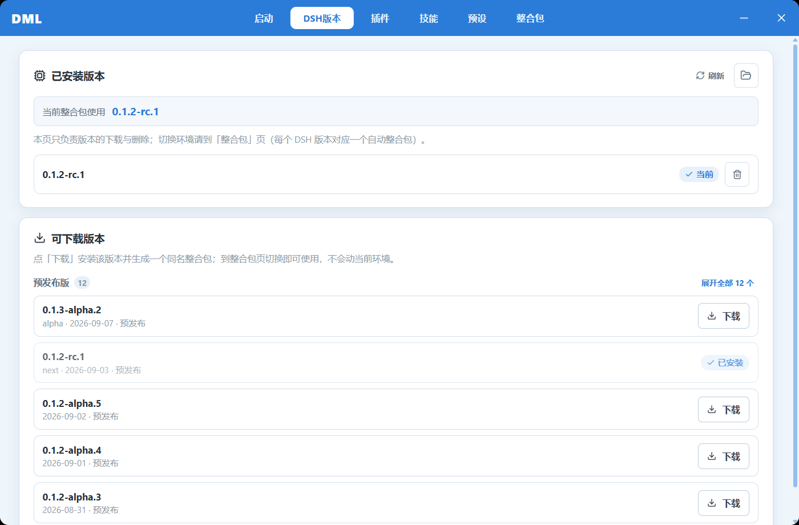
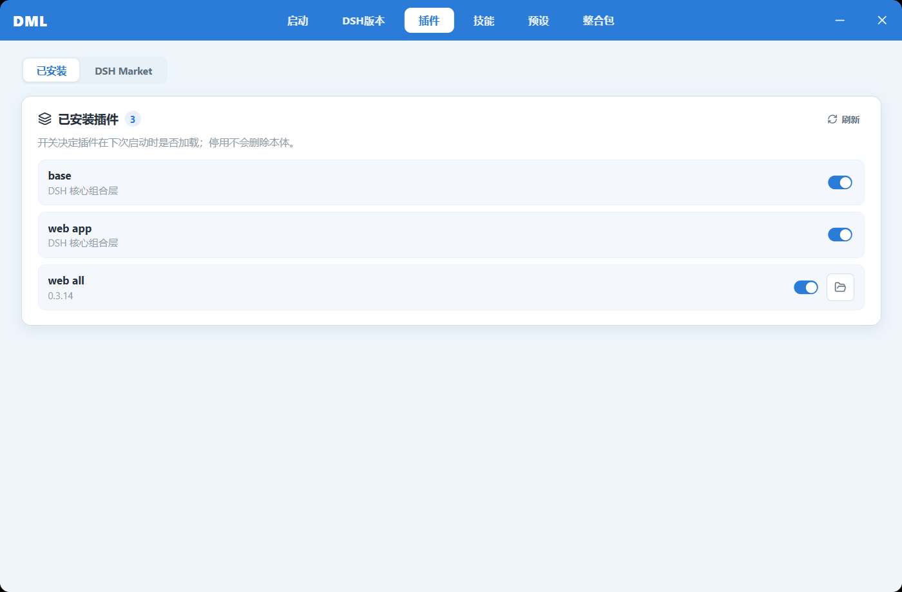
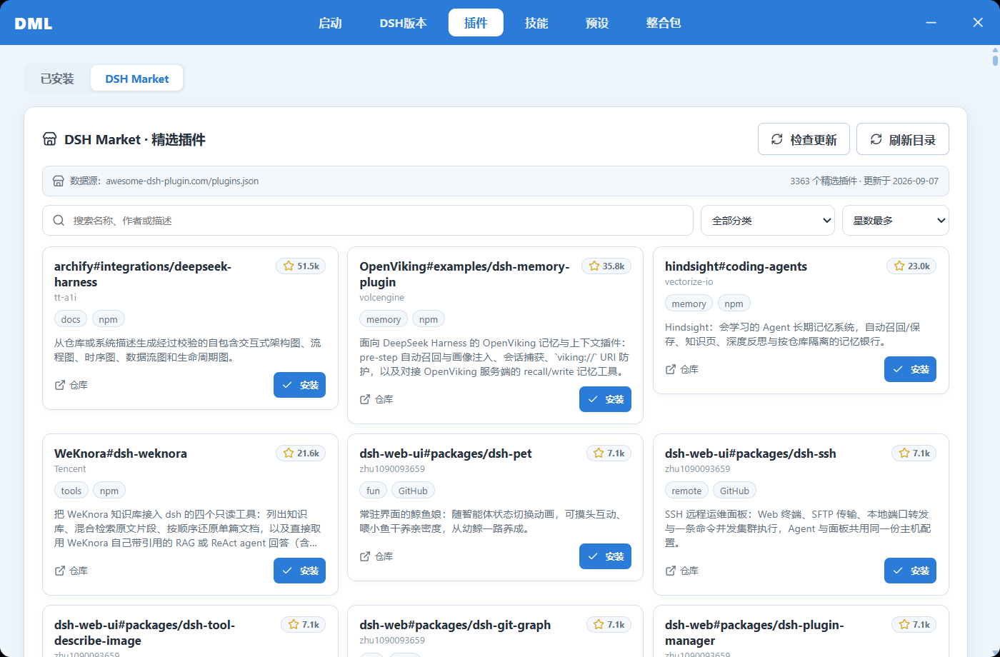
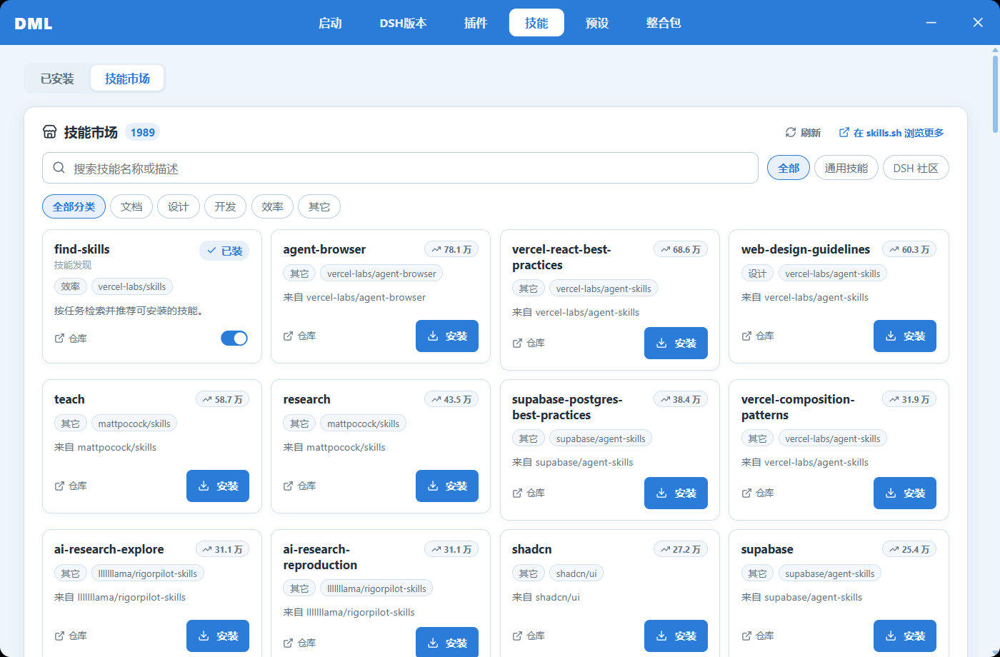
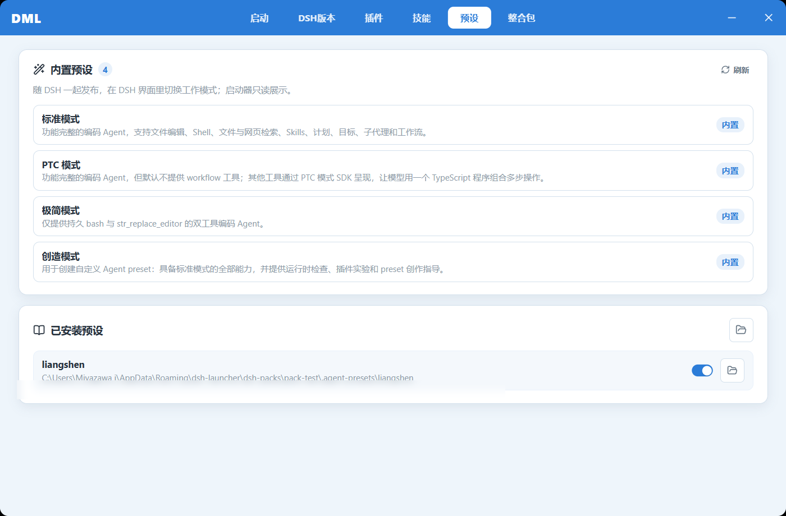
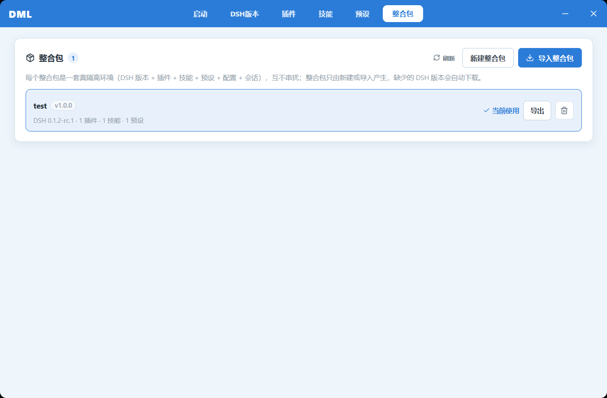
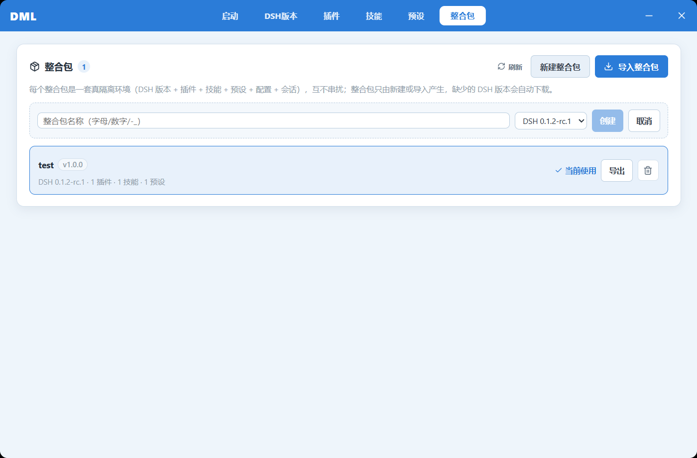

<div align="center">


# DSH 旋律启动器：序曲

**DSH-Melody-Launcher: Overture —— 面向 [DeepSeek Harness](https://github.com/deepseek-ai/deepseek-harness) 的 Windows 桌面启动器（C 端分支）**

以「整合包」为核心：每个整合包都是一套**真隔离环境**，版本、插件、技能、预设互不串扰，下载即用、无需预装 Node.js。

<br />

[](https://github.com/Miyazawai/DSH-Melody-Launcher-Overture/releases/latest)
[](https://github.com/Miyazawai/DSH-Melody-Launcher-Overture/actions/workflows/build.yml)
[](https://github.com/Miyazawai/DSH-Melody-Launcher-Overture/releases)
[](https://github.com/rirko/dsh-melody-launcher)
[](https://github.com/Miyazawai/DSH-Melody-Launcher-Overture)

[](https://www.electronjs.org/)
[](https://react.dev/)
[](https://www.typescriptlang.org/)
[](https://vite.dev/)
[](https://vitest.dev/)

**简体中文** · [English](README.en.md)

</div>

---

> [!NOTE]
> **关于本仓库**：「序曲（Overture）」是 [rirko/dsh-melody-launcher](https://github.com/rirko/dsh-melody-launcher) 的 **C 端分支**，对应「暴力整合包模式」产品线。上游仓库是启动器的主线；本分支聚焦**个人玩家的整合包体验**——零包引导、按包隔离、一键启动，玩法上更「开箱即玩」。架构与词汇表见上游主线，本分支的增量决策记录在各提交与 `CONTEXT.md`。

---

## 这是什么

**DSH 旋律启动器：序曲** 把 DeepSeek Harness（DSH）的下载、部署、插件管理和启动流程收拢到一个图形界面里。交互方式参考《我的世界》**忘却的旋律启动器**：在真正启动之前，先在一个地方把版本、插件、技能、预设都安排妥当。

「序曲」这一版的核心概念是**整合包（Modpack）**：

> 每个整合包 = 一套真隔离环境（DSH 版本 + 插件 + 技能 + 预设 + 配置 + 会话），互不串扰。你可以同时养着「稳定工作包」和「尝鲜测试包」，随点随切。

| 原本要做的事 | 用启动器之后 |
| --- | --- |
| 装 Node.js → 装 npm → `npx @deepseek-ai/dsh` | 下载一个 exe，点「下载安装 DSH」 |
| 手改 `.credentials.yaml` 填 API Key | 界面里输入，自动写入并设为 0600 权限 |
| 翻 GitHub 找插件、手敲 `dsh plugin add` | 内置 DSH Market / 技能市场，一键安装 |
| 多套环境互相污染，删了重装 | 新建一个整合包，天然隔离，互不影响 |
| 开终端、记命令、盯输出 | 一个按钮启动，进程与日志全程托管 |

## 界面速览

| | |
| --- | --- |
| **启动页** —— AI 日报（当日全部栏目分组滚动）、一键启动、当前整合包快切 | **DSH 版本** —— 已装版本与预发布版一目了然，一键下载 |
|  |  |
| **插件** —— 启停开关管理已装插件 | **DSH Market** —— 3300+ 精选插件，搜索 / 分类 / 检查更新 |
|  |  |
| **技能市场** —— 1900+ 技能，按分类浏览安装 | **预设** —— 内置四种工作模式，已装预设启停管理 |
|  |  |
| **整合包** —— 新建 / 导入 / 切换 / 导出，计数实时刷新 | **新建整合包** —— 命名 + 必选 DSH 版本，即建即用 |
|  |  |

## 核心特性

### 整合包：真隔离环境

- **按包隔离** —— 每个整合包有独立的派生家目录，DSH 版本、插件、技能、预设、配置、会话全套隔离，互不串扰
- **新建即选版本** —— 新建整合包时必选 DSH 版本，缺的版本自动下载，不会动当前环境
- **导入 / 导出** —— 整合包可打包分享、可导入他人配置，`packs.json` 唯一清单管理
- **零包引导态** —— 删光所有整合包不慌：三步引导卡带你从零重建，不会偷偷生成兜底包
- **实时计数** —— 整合包列表实时探测包家目录，市场 / npm 装的东西不会显示 0

### 零依赖部署

- **一键安装 DSH** —— 未检测到本地 DSH 时，首页主按钮自动切换为「下载安装 DSH」
- **自动准备 Node.js** —— 自动下载便携运行时（SHA-256 校验、断点续传），不需要系统装 Node
- **自动准备 pnpm** —— 首次管理插件时安装启动器专用 pnpm，不污染全局

### 启动与进程管理

- **一个按钮启动** —— 启动器以 `dsh --profile <整合包> --no-open --port N` 的形态拉起对应包，服务就绪自动打开网页
- **进程生命周期托管** —— 启动、停止、实时日志；退出启动器时同步收尾 DSH 及伴随进程
- **失败原因直达** —— DSH 异常退出时，命令、退出码、stderr 以错误弹窗呈现，不用翻日志猜

### 统一资源市场

- **DSH Market** —— 精选插件目录（awesome-dsh-plugin 数据源），搜索、分类、检查更新
- **技能市场** —— 按 `dsh-skill` Topic 聚合的技能仓库，严格校验 `SKILL.md` 结构后安装
- **启停 ≠ 卸载** —— 开关只控制下次启动是否加载；只有显式卸载才删除本体
- **核心组合层保护** —— DSH 核心 Bundle 在主进程层面禁止停用，防止一键把自己玩坏

### AI 日报

首页每日聚合当日 AI 资讯，**全部栏目**分组展示：要闻 / 模型发布 / 开发生态 / 产品应用 / 技术与洞察 / 行业动态 / 前瞻与传闻，卡片内直接滚动阅读。

## 快速开始

### 1. 下载

前往 [**Releases**](https://github.com/Miyazawai/DSH-Melody-Launcher-Overture/releases) 下载 `DSH-Launcher-*-portable.exe`，单文件、免安装。

> [!IMPORTANT]
> 便携版目前**未使用商业代码签名证书**。首次运行时 Windows SmartScreen 可能提示来源未知 —— 请确认文件确实来自本仓库 Release 页面后，选择「更多信息 → 仍要运行」。

### 2. 首次部署

打开启动器，没检测到 DSH 时首页主按钮就是「下载安装 DSH」，点一下即可。全程**不需要预装 DSH / Node.js / npm**，缺什么启动器自己补什么。

### 3. 新建你的第一个整合包

进入「**整合包**」页 → 点「**新建整合包**」→ 起个名字、选一个 DSH 版本 → 「**创建**」。然后回启动页点「**启动 DSH**」，你的专属隔离环境就跑起来了。

### 4. 配置 API Key

在界面里填入 DeepSeek API Key，启动器会写入对应整合包的官方凭据文件，权限 0600。

## 从源码运行

```powershell
git clone https://github.com/Miyazawai/DSH-Melody-Launcher-Overture.git
cd DSH-Melody-Launcher-Overture
npm install
npm run dev           # 开发模式
npm test              # Vitest 全量测试
npm run build         # 类型检查 + 产物构建
npm run package:win   # 打包 Windows 便携 exe
```

要求 Node.js ≥ 20。

> [!TIP]
> **发版**：推 `v*` 标签即可触发 CI 自动打包并把便携 exe 挂到 Release：
> `git tag -a v0.1.0 -m "v0.1.0" && git push origin v0.1.0`
> 版本号与 `package.json` 的 `version` 保持一致，exe 文件名由它决定。

## 数据与配置

| 内容 | 位置 |
| --- | --- |
| 启动器数据（packs.json / 设置 / 运行时） | `%APPDATA%\dsh-launcher` |
| 整合包家目录 | `%APPDATA%\dsh-launcher\dsh-packs\<包id>` |
| DSH 版本缓存 | `%APPDATA%\dsh-launcher\dsh-runtime\versions` |
| 默认 DSH 家目录 | `~/.dsh` |

## 与上游的关系

- 上游主线：[rirko/dsh-melody-launcher](https://github.com/rirko/dsh-melody-launcher) —— 启动器主线开发与正式 Release
- 本分支：C 端「暴力整合包模式」产品线，聚焦整合包隔离与个人玩家体验
- 两边共享核心架构（派生家目录咽喉点、packs.json 唯一清单、导入前置供给等）；本分支的增量以「首公里上手体验」为准绳：**零依赖部署、版本隔离、进程管理**

## 联系与反馈

- 官方用户 QQ 群：**625155044**（欢迎一起开发，QQ：1250104511）
- 问题反馈请开 [Issue](https://github.com/Miyazawai/DSH-Melody-Launcher-Overture/issues)，附上启动器版本与复现步骤

---

项目坚持**非盈利**方向。启动器只是本地工具，所有 DSH 相关资源版权归 DeepSeek 各自权利人所有。
